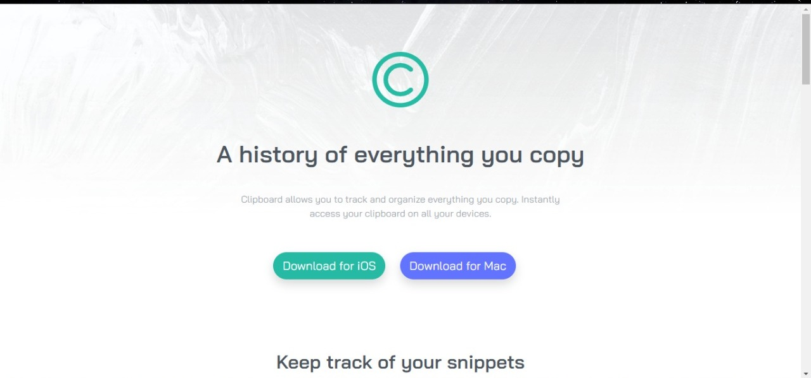

# Frontend Mentor - Clipboard landing page solution

This is a solution to the [Clipboard landing page challenge on Frontend Mentor](https://www.frontendmentor.io/challenges/clipboard-landing-page-5cc9bccd6c4c91111378ecb9). Frontend Mentor challenges help you improve your coding skills by building realistic projects. 

## Table of contents

## Overview

### The challenge

Users should be able to:

- View the optimal layout for the site depending on their device's screen size
- See hover states for all interactive elements on the page

### Screenshot

### Links

- Solution URL: [https://github.com/bosirullah/clipboard-landing-page](https://github.com/bosirullah/clipboard-landing-page)
- Live Site URL: [https://bosirullah.github.io/clipboard-landing-page](https://bosirullah.github.io/clipboard-landing-page)

## My process

### Built with

- Semantic HTML5 markup
- CSS custom properties
- Flexbox
- Mobile-first workflow
- [bootstrap](https://getbootstrap.com/docs/5.2/getting-started/introduction/) - css framework

### What I learned

I learnt implementing grid box using bootstrap 5 and used flexbox in certain areas and created a responsive layout

## Author

- Website - [MD BOSIRULLAH MONDAL](https://bosirullah.github.io/clipboard-landing-page)
- Frontend Mentor - [@bosirullah](https://www.frontendmentor.io/profile/bosirullah)
